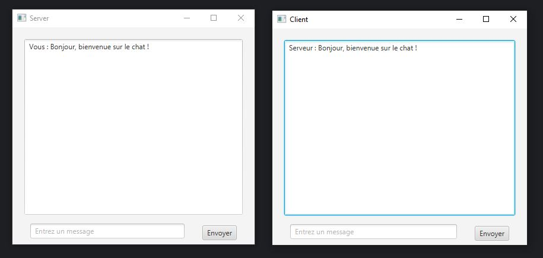
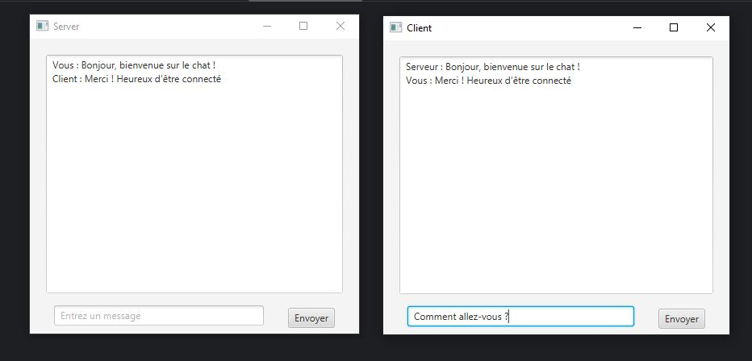
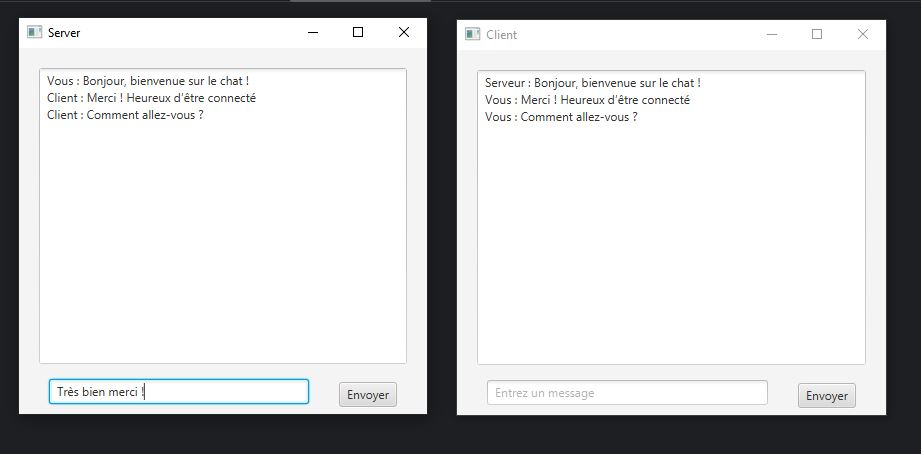

# Application de Chat en Java

Cette application est un système de messagerie simple développé en Java.
Elle utilise **JavaFX** pour l’interface graphique, les **sockets TCP** pour la communication réseau,
et les **threads** pour assurer des échanges en temps réel sans bloquer l'interface.

---

##  Fonctionnalités

- Interface graphique intuitive avec **JavaFX**
- Connexion entre un **client** et un **serveur local** via socket TCP
- **Échange de messages en temps réel**
- Fermeture automatique de la communication en envoyant le message `"bye"`

---

## ️ Technologies utilisées

- `JavaFX`
- `Sockets TCP`
- `Multithreading` (gestion des échanges de messages en temps réel sans interrompre l'interface utilisateur)
---

##  Aperçu de l'application

### 1. Le serveur envoie un premier message

### 2. Le client reçoit le message et répond

### 3. Échange continu de messages entre client et serveur

---

##  Lancement

1. Démarrer le **serveur**
2. Lancer le **client**
3. Échanger des messages librement jusqu’à ce que l’un envoie `"bye"` pour fermer la communication

